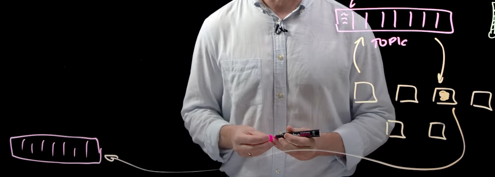

# Kafka Tuto

This is a very simple kafka tuto

Resources for further reading :
* [Kafka in 100s](https://www.youtube.com/watch?v=uvb00oaa3k8)
* [Intro to kafka](https://kafka.apache.org/intro)

# Motivation behind kafka

## Thinking about things as events
Elements of a Database was perceived in the past as **things**, but after it appears that it's better to think in those elements as events, that has **An indication in time**, so we store data in what we called a **log**

* **Log data** is a digital record of events occurring within a system, application or on a network device or endpoint.

**Kafka** comes in handy simply as a tool to manage this events

* **Topic** : <ins>Ordered/persistent collection of events</ins> stored in a durable way(*written to disk and ruplicated to ensure that no server failure will cause this data instance to go away*)

* **Event** : A thing happening in business. (*Someone both a new book fro example*)

## Moving from Monolith to Microservices

Services can talk to each others using kafka topics, and not neccesary go back to the same topic

If a Database is already there (in the old fashion ) we can write it as a topic a work with it alongside kafka

Kakfa API have all tools one may need to work and moddle databases:
* Connect to databases
* Count
* Agregate
* Join
* ...

# How it works in general :
1. When an event occurs, like a website visit, the producer API creates a new record, stored in the disk in an Ordered and Immutable log, which is the **Topic**

2. 

# Kafka as an event streaming platform

Check [Intro to kafka](https://kafka.apache.org/intro) for this questions.
